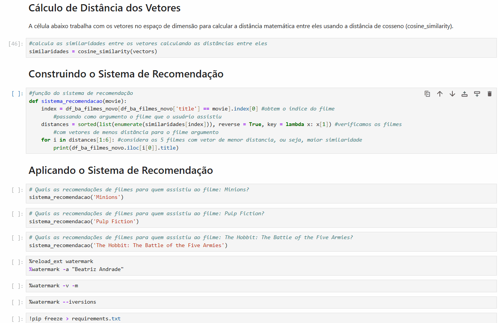

# 🎬 Sistema de Recomendação de Filmes

[](https://www.python.org/)
[](https://scikit-learn.org/)
[](https://pandas.pydata.org/)

Sistema de recomendação de filmes baseado em filtragem por conteúdo usando Machine Learning. O sistema analisa características de filmes (gênero, elenco, diretor, sinopse) e recomenda títulos similares através de vetorização de texto e cálculo de similaridade de cosseno.

---

## 🎬 Demonstração



---

**Exemplo de recomendação:**
```python
sistema_recomendacao('Avatar')

# Resultado:
# Aliens vs Predator: Requiem
# Aliens
# Falcon Rising
# Independence Day
# Titan A.E.
```

<details>
<summary>📊 <b>Ver mais exemplos de recomendações</b></summary>

| Filme Consultado | Top 5 Recomendações |
|------------------|---------------------|
| **Avengers: Age of Ultron** | Iron Man 3, Iron Man 2, Iron Man, Thor, The Avengers |
| **Jurassic World** | Jurassic Park, The Lost World, Walking With Dinosaurs, Terminator Genisys, Jurassic Park III |

</details>

---

## 🎯 Sobre o Projeto

### **Objetivo**
Construir um sistema inteligente que recomende 5 filmes similares ao que o usuário assistiu, mantendo-o engajado na plataforma.

### **Metodologia**
1. **Preparação de Dados:** Merge de datasets, extração de features (gênero, elenco, diretor, sinopse)
2. **NLP:** Stemming, normalização e remoção de stop words
3. **Vetorização:** CountVectorizer com 5.000 features, transformação de texto em matriz numérica esparsa
4. **Similaridade:** Cosine similarity para medir distância entre filmes

### **Dataset**
- **Fonte:** [The Movie Database (TMDb)](https://developer.themoviedb.org/docs)
- **Total:** 4.806 filmes processados

---

## 🛠️ Tecnologias

```python
Python 3.13
├── pandas 2.3.0          # Manipulação de dados
├── numpy 2.3.1           # Computação numérica
├── scikit-learn 1.7.1    # Machine Learning
│   ├── CountVectorizer   # Vetorização
│   └── cosine_similarity # Distância de cosseno
└── nltk 3.9.1            # NLP e stemming
```

---

## 🚀 Como Executar

<details>
<summary><b>📥 Clique para ver as instruções de instalação</b></summary>

### **Pré-requisitos**
- Python 3.8 ou superior
- pip instalado
- Jupyter Notebook

### **Passo a passo**

```bash
# 1. Clone o repositório
git clone https://github.com/biasandrade/sistema-recomendacao-filmes.git

# 2. Entre na pasta do projeto
cd sistema-recomendacao-filmes

# 3. Instale as dependências
pip install -r requirements.txt

# 4. Obtenha os dados (ver seção abaixo)

# 5. Abra o Jupyter Notebook
jupyter notebook Projeto1_Filme_BeatrizAndrade.ipynb
```

### **📂 Obtendo os Dados**

⚠️ Os arquivos CSV não estão incluídos no repositório devido ao tamanho (>25MB).

**Opção 1:** Baixe da fonte original
- [TMDb API](https://developer.themoviedb.org/docs)

**Opção 2:** Entre em contato
- 📧 biasandrade@gmail.com
- 💼 [LinkedIn](https://www.linkedin.com/in/andrade-beatriz/)

Coloque os arquivos na pasta `dados/`:
```
dados/
├── dataset_filmes.csv
└── dataset_elenco.csv
```

</details>

---

## 🧠 Conceitos Aplicados

<details>
<summary><b>Clique para expandir os conceitos técnicos</b></summary>

### **Matemática e Estatística**
- Álgebra Linear (vetores e espaços vetoriais)
- Distância de cosseno
- Similaridade entre vetores multidimensionais

### **Machine Learning**
- Aprendizado não supervisionado
- Sistemas de recomendação baseados em conteúdo
- Feature engineering

### **NLP**
- Tokenização
- Stemming (Porter Stemmer)
- Bag of Words (BoW) (texto em números)
- Term Frequency (frequência da aparição da palavra)

</details>

---

## 📚 Aprendizados

**Habilidades desenvolvidas:**

✅ Vetorização de texto  
✅ Processamento de linguagem natural  
✅ Cálculo de similaridade  
✅ Sistemas de recomendação  
✅ Feature engineering  

---

## 🔮 Melhorias Futuras

- [ ] Implementar TF-IDF para melhor ponderação (frequência e raridade da aparição da palavra)? (Talvez)
- [ ] Interface web com Streamlit
- [ ] Incluir avaliações de usuários (ratings)

---

## 👩‍💻 Autora

**Beatriz Andrade**  
Cientista de Dados | 18 anos de experiência com análise de dados

[](https://www.linkedin.com/in/andrade-beatriz/)
[](mailto:biasandrade@gmail.com)

---

Este projeto faz parte do curso "Matemática e Estatística Aplicada Para Data Science, Machine Learning e IA" do curso de Pós-graduação em Data Scienceda da Data Science Academy.

## 📄 Licença

Este projeto está sob a licença MIT. Sinta-se livre para usar, modificar e distribuir.

---

⭐ Se este projeto te ajudou, considere dar uma estrela no repositório!
